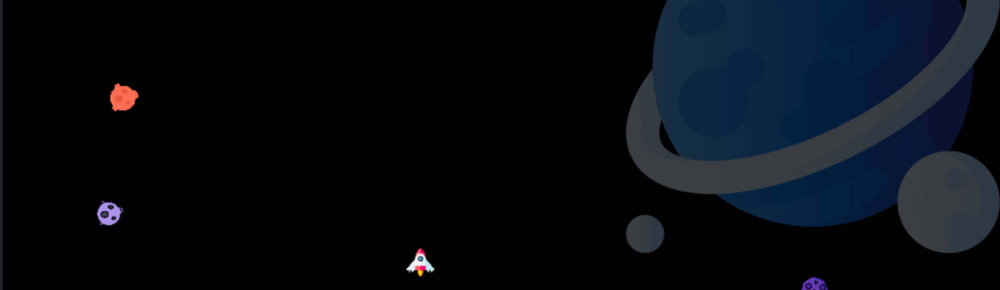

# Видео хостинг - Аниме

Одиночная игра, где вам нужно сбивать ракетой астероиды выпуская по ним торпеды. С каждым уровнем выше - будет появляться больше астероидов. Всего ракета может выдержать четыре попадания. Задержка на стрельбу ракетами в одну секунду. Игра сделана для лучшего понимания разработки 2д игор. Написана на Canvas. Присутствуют звуки стрельбы, попадания, окончания игры и тд.
# Используемые технологии
 + Canvas

